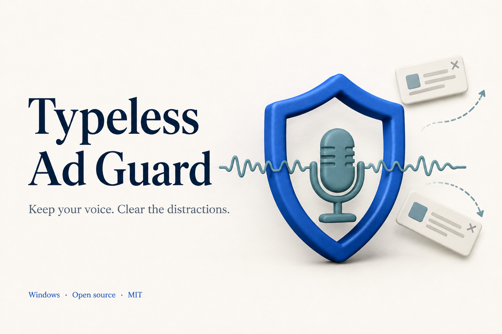

# Typeless Ad Guard



Typeless Ad Guard 是一个 Windows 托盘小工具，帮你自动关闭 Typeless 中已适配的升级提示，保留 Ctrl+Alt 语音输入窗口。它通过窗口事件和控件接口识别提示，无需截图或 OCR；解压即可使用，源码采用 MIT 许可证开放。独立社区项目，与 Typeless 官方无隶属关系。

**0.1.0-preview.1 · Windows 10/11 x64 · .NET Framework 4.8 或更高版本**

## 下载与使用

**[下载 Windows 便携版](https://github.com/bestyunan/TypelessAdGuard/releases/download/v0.1.0-preview.1/TypelessAdGuard-0.1.0-preview.1-windows-x64.zip)** · [版本说明与校验文件](https://github.com/bestyunan/TypelessAdGuard/releases/tag/v0.1.0-preview.1)

下载发布者上传的 `TypelessAdGuard-0.1.0-preview.1-windows-x64.zip`，完整解压后双击 `TypelessAdGuard.exe`。保留旁边的 `.exe.config` 文件。不要直接在 ZIP 预览窗口中运行。

不需要 Codex、Python、Node 或开发工具。Windows 11 和较新的 Windows 10 通常已有所需的 .NET Framework；可参考[微软安装说明](https://learn.microsoft.com/en-us/dotnet/framework/install/)。本预览版本未在另一台物理电脑或干净虚拟机上验证，请先小范围试用。

首次启动会显示状态窗口：

- 自动查找当前用户保存的位置、正在运行的 Typeless 和常见安装目录。
- 未找到时，点击“选择 Typeless…”选中已安装的 `Typeless.exe`。
- “已连接”表示已成功读取目标状态窗口并订阅事件；不是只根据进程存在判断。
- “等待语音窗口 / 检查权限”时，按 Ctrl+Alt 显示语音窗口，再点“重新检测”。若 Typeless 以管理员身份运行，助手也需使用相同权限。
- 关闭状态窗口会继续在托盘运行。双击托盘盾牌或再次双击 EXE 可打开状态窗口。右键托盘可暂停、只观察或退出。

如果火绒等工具先拦截了 Typeless 的整个 Status 窗口，需要暂停对应误拦规则；本工具不会自动修改安全软件设置。

## 支持范围

目前匹配完整标题与说明，以及一个无名称关闭按钮和一个 Upgrade 按钮：

1. **Upgrade for enhanced accuracy** — “Upgrade to Typeless Pro for unlimited words, enhanced accuracy, and priority access during high demand.”
2. **High demand** — “Typeless is busier than usual right now. Upgrade to Typeless Pro to get priority access.”

标题和正文必须成对。只使用 UI Automation Invoke 关闭广告，不调用 Upgrade，不关闭整个 Status。未知文案、结构变化或接口异常时跳过。当前适配依据为 Typeless 2.5.0；其他版本、语言和广告尚未保证兼容。

它在相关事件发生时读取控件；不会持续截图、做 OCR、监听键盘或模拟鼠标。提示可能短暂闪现。本工具不会解锁付费功能，也不会修改 Typeless 安装包、订阅、联网设置或快捷键。

## 配置与日志

配置和日志写入当前用户的 `%LOCALAPPDATA%\TypelessAdGuard`，不写到 EXE 所在目录，因此程序文件夹可以是只读的。配置只保存你选择的安装路径；日志按目标隔离并轮换。

不上传数据，不记录录音、转写或截图。日志可能包含进程和窗口标识；分享诊断材料前请自行检查。

退出后删除程序目录即可移除便携版；若也要清除本机配置，可自行删除上述数据目录。工具不会设置开机自启。

## 故障排查

| 状态或现象 | 处理 |
|---|---|
| 未找到 Typeless | 选择正确的 Typeless.exe |
| 等待 Typeless 启动 | 启动 Typeless，核对路径；无法读取进程路径时也可能显示此状态 |
| 一直未连接 | 显示语音窗口，重新检测，核对双方运行权限 |
| 连接异常 | 查看日志；可能是接口失败、读取超时或版本结构不同 |
| 广告仍然显示 | 确认是上述两条文案；保持弹窗以便诊断，未知广告会安全跳过 |
| 启动无窗口 | 查托盘；重复运行会复用同一目标的实例 |

当前 EXE 未进行代码签名，下载后可能显示“未知发布者”；请从可信来源下载，并核对发布的 SHA256 校验值。

## 开发

```powershell
.\build.ps1
.\test-policy.ps1
.\test-portable.ps1
.\tests\integration.ps1
.\tests\portable-smoke.ps1 -GuardPath .\TypelessAdGuard.exe
.\package.ps1
```

编译脚本使用 Windows 的 .NET Framework x64 C# 编译器，不下载依赖。集成测试创建专用合成窗口，包括六层 Custom 包装、两条广告及误操作反例；只作用于测试目标。

高级参数：`--background`、`--observe`、`--target "完整路径"`、`--data-dir "独立数据目录"`、`--probe`（只读）、`--self-check`（运行环境）、`--stop`。指定自定义目标/数据目录的实例，停止时应传相同参数。`--once` 是开发用单次匹配关闭操作。

参见 [兼容性验证](docs/COMPATIBILITY.md) 和 [发布流程](docs/RELEASING.md)。本工具以 [MIT](LICENSE) 许可证发布；该许可证不覆盖 Typeless 本身。

## 赞赏

如果这个小工具帮你减少了打断，欢迎自愿赞赏，支持后续维护。微信和支付宝收款二维码稍后补充。软件免费使用，赞赏不影响任何功能。
